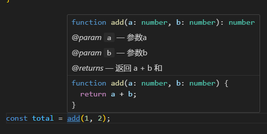

<div align="center">
  
  <h2>npm 发包</h2>
</div>

## 目标

使用 `npm install xxx` 来安装属于自己的包

## 初始化

- 创建目录
- 初始化 `npm init` `git init`
- 填写 `package.json` 一些字段

```json
{
  "name": "zb-trans",
  "version": "1.0.0",
  "author": "codexy",
  "description": "原始坐标、高德坐标、百度坐标本地js坐标转换",
  "license": "MIT",
  "homepage": "https://github.com/xxyu98/zb-trans",
  "bugs": "https://github.com/xxyu98/zb-trans/issues",
  "main": "index.js",
  "scripts": {
    "build": "tsc",
    "format": "prettier --write \"src/**/*.ts\" \"src/**/*.js\"",
    "lint": "tslint -p tsconfig.json",
    "test": "jest --config jestconfig.json",
    "prepare": "npm run build",
    "prepublishOnly": "npm run test && npm run lint",
    "preversion": "npm run lint",
    "version": "npm run format && git add -A src",
    "postversion": "git push && git push --tags"
  },
  "keywords": [
    "坐标转换",
    "coordinate",
    "WGS-84",
    "gcj02",
    "bd09",
    "transform"
  ],
  "files": ["lib/**/*"],
  "repository": {
    "type": "git",
    "url": "https://github.com/xxyu98/zb-trans"
  },
  "devDependencies": {
    "@types/jest": "^29.5.3",
    "jest": "^29.6.2",
    "prettier": "^3.0.2",
    "ts-jest": "^29.1.1",
    "tslint": "^6.1.3",
    "tslint-config-prettier": "^1.18.0",
    "typescript": "^5.1.6"
  }
}
```

生成 license

```shell
npx mit-license --name codexy
```

## 编写你 npm 包代码

- 创建 `src` 目录
- 新增 `index.ts` 编写逻辑，并添加 JSDoc 来增加代码提示

```js
/**
 * @param a 参数a
 * @param b 参数b
 * @returns 返回 a + b 和
 */
function add(a: number, b: number) {
  return a + b;
}
```

- 效果



- 新增 `tsconfig.json`

```json
// tsconfig.json 文件来指定编译这个项目的根文件和编译选项
{
  "compilerOptions": {
    "target": "es5", // 编译后 js 文件遵循标准
    "module": "commonjs", // 指定生成什么模块系统代码
    "declaration": true, // 是否生成对应声明文件
    "outDir": "./lib", // 输出目录
    "strict": true,
    "lib": ["es6"] // 指定一组描述目标运行时环境的捆绑库声明文件
  },
  "include": ["src"], // 编译目录
  "exclude": ["node_modules", "**/__tests__/*"] // 不编译目录
}
```

- 也可以新增 `README.md` 介绍
- 提交代码✔

## 发布

[注册 npm 账号](https://www.npmjs.com/)

```shell
# 确保是使用的是 npm 源
# 查看源
npm config get registry
# 修改源
npm config set registry https://registry.npmjs.org

# 登录
npm login

#发布
npm publish
```

## 已经发布的包

[zb-trans](https://www.npmjs.com/package/zb-trans)

原始坐标、高德坐标、百度坐标本地js坐标转换
