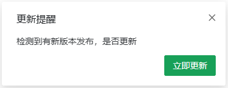
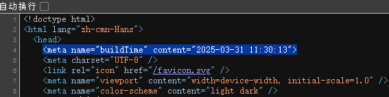

<div align="center">
  
  <h2>更新提醒</h2>
</div>

## 目标

实现一个前端项目更新上线提醒 

## 实现一个简单的vite插件

- vite 插件

```javascript
import type { Plugin } from 'vite';

export function setupHtmlPlugin(buildTime: string) {
  const plugin: Plugin = {
    name: 'html-plugin', // 插件名称
    apply: 'build', // serve | build 表示在服务或构建期间调用
    transformIndexHtml(html) {
      // vite 转换 index.html 的专用钩子 钩子接收当前的 HTML 字符串
      // 在 head 内插入 buildTime信息
      return html.replace('<head>', `<head>\n    <meta name="buildTime" content="${buildTime}">`);
    }
  };

  return plugin;
}
```

- 使用插件

```javascript
import { defineConfig } from 'vite';
import dayjs from 'dayjs';
import { setupHtmlPlugin } from '@/plugin/html';

export default defineConfig(() => {
  const buildTime = dayjs().format('YYYY-MM-DD HH:mm:ss');
  return {
    // ...
    plugins: [setupHtmlPlugin(buildTime)],
  };
});
```

- 将会在源码插入对应meta标签



### 检测机制

- 检查是否有新版本

```javascript
async function getHtmlBuildTime() {
  const res = await fetch(`/index.html?time=${Date.now()}`);

  const html = await res.text();

  const match = html.match(/<meta name="buildTime" content="(.*)">/);

  const buildTime = match?.[1] || '';

  return buildTime;
}

async function hasNewVersion() {
  const currentBuildTime = document.querySelector(
    'meta[name="buildTime"]'
  )?.content;

  const latestBuildTime = await getHtmlBuildTime();

  if (!currentBuildTime || !latestBuildTime) return false;

  if (currentBuildTime !== latestBuildTime) return true;
}

async function checkUpdate() {
  const isDev = import.meta.env.DEV;
  if (isDev) return;

  const hasNew = await hasNewVersion();
  if (hasNew) {
    // 提示更新 根据需求展示
    // alert notification message modal...
  }
}
```

- 检测时机

```javascript
// 1
document.addEventListener('visibilitychange', async () => {
  if (document.visibilityState === 'visible') {
    checkUpdate();
  }
});

// 2

setTimeOut(() => {
  checkUpdate();
}, 3600);

// 在 app.vue 中调用
```

可以在页面可见时检测更新 或者设置一个定时器轮询检测
