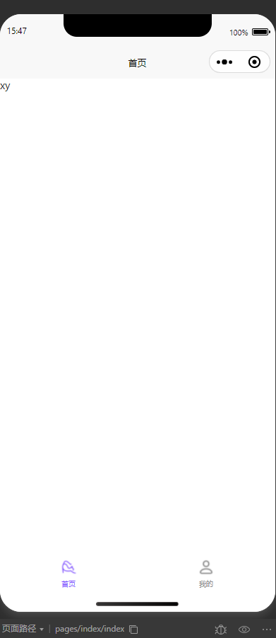
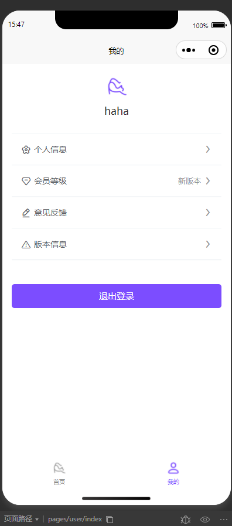
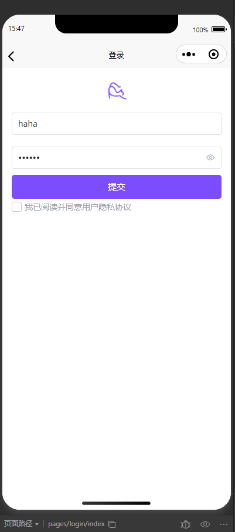
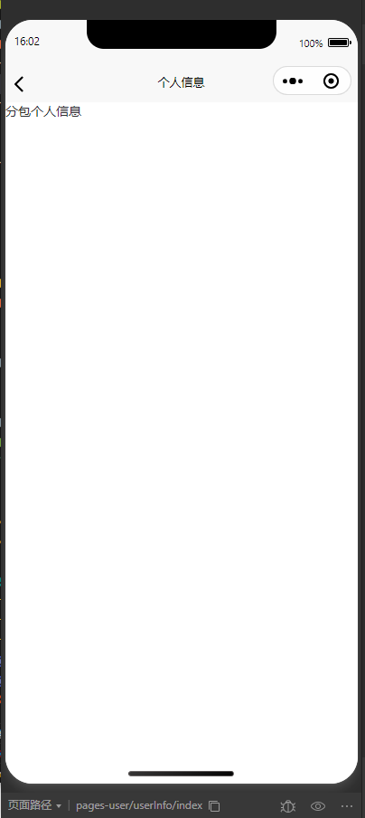
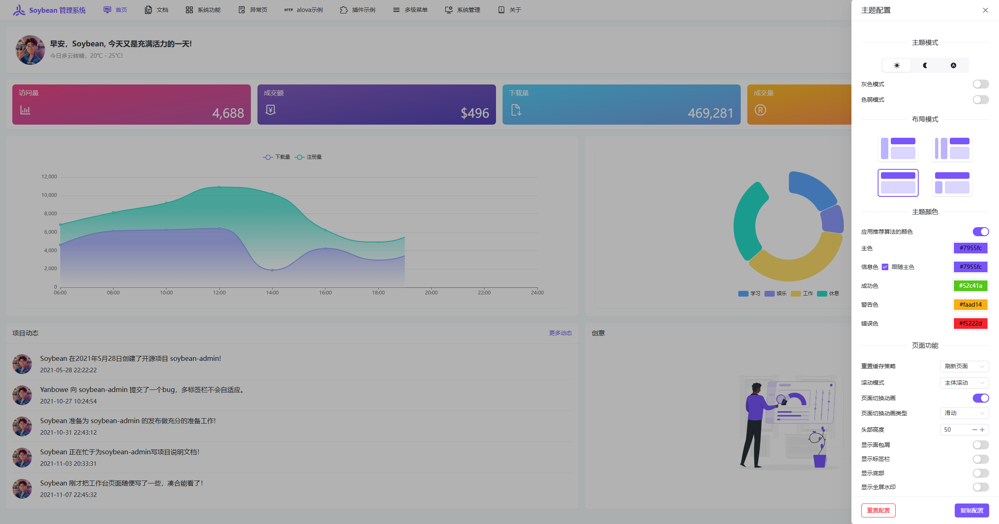

## 模板推荐

### uni-app

- [仓库地址](https://gitee.com/codexly/vue3-uniapp/tree/v0.0.1)
- 一个 vue 3.x cli uni-app `简洁`模板
- 内置最小单位 `tabbar` 页面 `subPackages` 分包 `pinia` 示例

  
  
  
  

### 中后台模版

- [仓库地址](https://github.com/soybeanjs/soybean-admin)
- 基于 `Vue3` `Vite5` `TypeScript` `UnoCSS`
- `新技术栈` `主题可配置` `文档清晰`
- 多框架支持 作者开发有 `Vue` `React` 版本
- 多组件库集成 `Element Plus` `Naive UI` `Ant Design` `Ant Design Vue`
  
