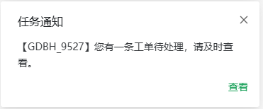

<div align="center">
  
  <h2>websocket</h2>
</div>

## websocket 介绍

- 最大特点就是，服务器可以主动向客户端推送信息，客户端也可以主动向服务器发送信息，是真正的双向对话
- 可以代替轮询，减少资源浪费
- 请求头内 _Connection: Upgrade_ _Upgrade: websocket_
- 数据格式比较轻量，性能开销小，通信高效。
- readyState

  - _CONNECTING_：值为0，表示正在连接。
  - _OPEN_：值为1，表示连接成功，可以通信了。
  - _CLOSING_：值为2，表示连接正在关闭。
  - _CLOSED_：值为3，表示连接已经关闭，或者打开连接失败。

- 接受socket信息实时通知
  

- vue3 代码示例

```javascript
import { defineStore } from 'pinia';
import { ref } from 'vue';

export const useWebSocketStore = defineStore('webSocket', () => {
  const socket = ref<WebSocket | null>(null);
  const isConnected = ref<boolean>(false);
  const timer = ref<NodeJS.Timeout | null>(null);
  const reconnectAttempts = ref<number>(0);
  const maxReconnectAttempts = 6;
  const reconnectInterval = 10000;

  const sendMessage = (message: string) => {
    if (socket.value && isConnected.value) {
      socket.value.send(message);
    } else {
      window.console.error('WebSocket is not connected');
      if (timer.value) {
        clearInterval(timer.value);
        timer.value = null;
      }
    }
  };

  const connect = (url: string, userId: string) => {
    if (socket.value) {
      socket.value.close();
    }

    socket.value = new WebSocket(url + userId);
    socket.value.onopen = () => {
      isConnected.value = true;
      reconnectAttempts.value = 0; // Reset reconnect attempts on successful connection
      if (socket.value?.readyState === WebSocket.OPEN) {
        timer.value = setInterval(() => {
          sendMessage('ping');
        }, 6000);
      }
    };

    socket.value.onmessage = (event: MessageEvent) => {
      const data = JSON.parse(event.data);
      if (data.msgType && data.content) {
        window.$notification?.success({
          message: data.msgType,
          description: data.content,
          duration: null
        });
      } else {
        window.$notification?.success({
          message: '您有新的通知',
          description: '您有新的通知，请前往消息列表查看',
          duration: null
        });
      }
    };

    socket.value.onclose = () => {
      isConnected.value = false;
      window.console.log('WebSocket disconnected');
      if (timer.value) {
        clearInterval(timer.value);
        timer.value = null;
      }
      if (reconnectAttempts.value < maxReconnectAttempts) {
        reconnectAttempts.value += 1;
        window.console.log(`Attempting to reconnect... (${reconnectAttempts.value}/${maxReconnectAttempts})`);
        setTimeout(() => {
          connect(url, userId);
        }, reconnectInterval);
      } else {
        window.console.error('Max reconnect attempts reached');
      }
    };

    socket.value.onerror = (error: Event) => {
      window.console.error('WebSocket error:', error);
      isConnected.value = false;
      if (timer.value) {
        clearInterval(timer.value);
        timer.value = null;
      }
    };
  };

  const disconnect = () => {
    if (socket.value) {
      socket.value.close();
    }
    reconnectAttempts.value = 0;
  };

  return {
    socket,
    isConnected,
    timer,
    reconnectAttempts,
    connect,
    sendMessage,
    disconnect
  };
});

```
